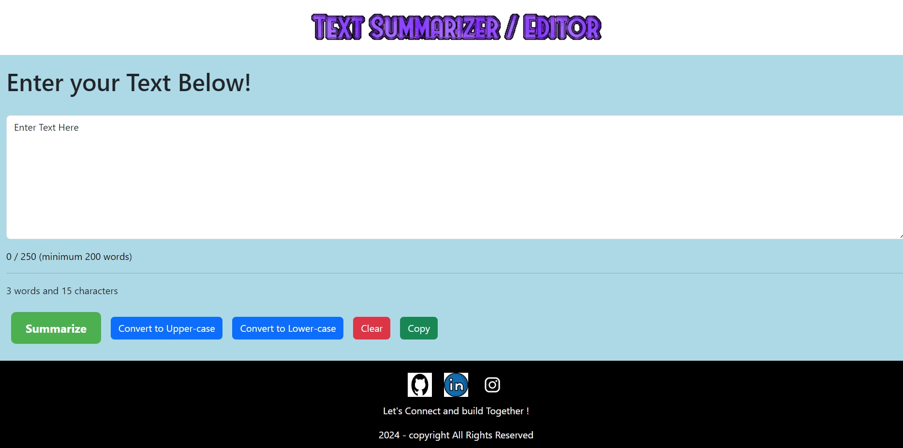
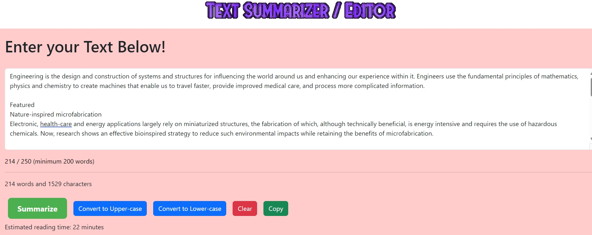
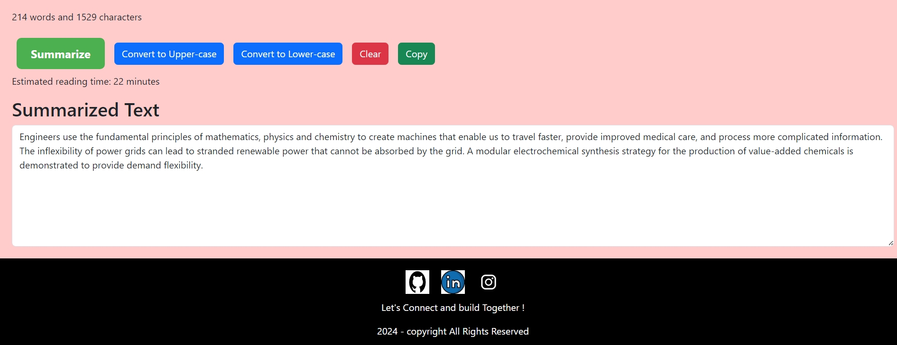

# Text-Summarizer/Editor

# Text Summarizer and Editor

## Overview

The Text Summarizer and Editor is a powerful tool designed to streamline the process of content creation and editing. This application combines the capabilities of automatic text summarization with a rich text editor, enabling users to quickly generate concise summaries and effortlessly refine their documents.

## Features

- **Automatic Text Summarization**: Generate brief and coherent summaries of long documents with a single click.
- **Rich Text Editing**: Edit your text with a full-featured editor that supports Changing Cases.
- **User-Friendly Interface**: Intuitive design for a seamless and efficient user experience.
- **Real-Time Collaboration**: Collaborate with others in real-time on the same document.


## Demo


 <hr />

 

 

## Installation

To get started, clone the repository and install the necessary dependencies:

```bash
git clone https://github.com/Atheeqxcode/Text-Editor.git
cd text-summarizer-editor
npm install

### Usage

Run the application locally with:

bash
Copy code
npm start
Open your browser and navigate to http://localhost:3000 to start using the Text Summarizer and Editor.

Contributing
We welcome contributions! Please read our contributing guidelines for more details.

License
This project is licensed under the MIT License. See the LICENSE file for more information.

